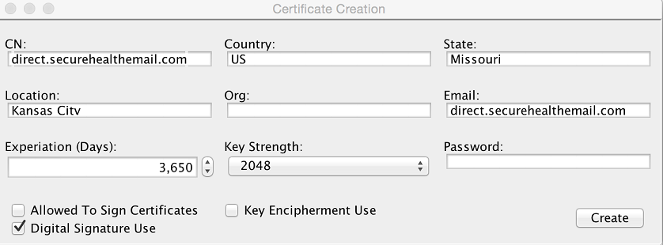
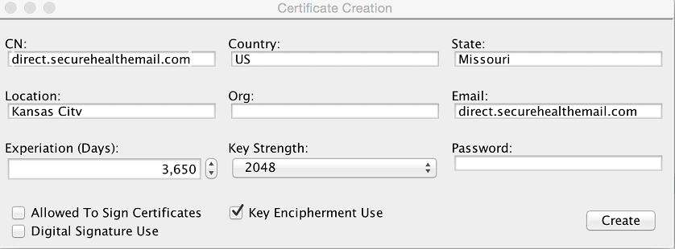

# Single Use Certificates

With federal and other governmental agencies implementation Direct, many of their policies dictate using single use certificates. Single use certificates are end entity certificates whose key usage asserts only the key encipherment or digital signature bit; dual use certificates assert both usages in one certificate. Because Direct uses both encryption and digital signature operations, it's apparent that single use certificates require 2 certificates for each domain or email address. Each certificate in a single use certificate pair contains the exact same attributes with the exception of the public/private key pair and key usage bit.

Although the Bare Metal assembly has been able to support single use certificates since version 3.0 via the policy [engine](https://directprojectjavari.github.io/direct-policy/), documentation did not exist that explicitly enumerated the steps to use it. This section will illustrate step by step how to enable single use certificate support.

## What does it mean

As stated in the preface of this section, single use certificates are enabled via the policy engine deployed in the agent and DNS servers. But what exactly does it mean to implement single use certificates? There are parts sides to the story:

1. Issuing single use certificates to addresses managed by your system
2. Consuming single use certificates issued by other systems

Let's start with the second aspect: consuming certificates from other system. By default, the Bare Metal assembly fully supports consuming single use certificates from other system because it does not enforce key usage of external certificates and utilized all valid and trusted discovered certificates for S/MIME operations. This adheres to a best practice for Direct; produce conservatively, but consume liberally. If your institution's local policy requires enforcing key usage and other policies on external certificates, we'll go into further configuration details later on in this section. For now, know that out of the box, Bare Metal has no issues with consuming single use certificates from other systems.

Back to managing your own single use certificates, the proper usage of single use certificates is to only sign messages with a certificate that asserts the digital signature key usage bit and only decrypt messages that assert the key encipherment key usage bit (the has an impact on your DNS configuration, but we'll go into that later).

## Obtaining Single Use Certificates

The first step to implementing single use certificates for your addresses is to obtain the certificates themselves. There are a couple ways to do this:

* Obtain single use certificates from a commercial CA such as DigiCert or IdenTrust.
* Create single use certificates with the CertGen tool.


The first option will most likely be required for participation in reputable trust communities, however, for test purposes we'll briefly illustrate how to create your own single use certificates.

First, navigate to the /tools directory of the Bare Metal deployment and launch the certGen [tool](https://directprojectjavari.github.io/agent/CertGen). You can either create a new root anchor certificate, or utilize the same one that you created in the initial deployment of you Bare Metal installation. Once the anchor is created or loaded from a previously created anchor, click on the **Create Leaf Cert** button. Next go through the same steps as you normally would to create a leaf cert, however uncheck the *Key Encipherment Use* option and click the **Create** button.



This creates a certificate (actually three files) that only asserts the digital signature key usage bit. You will now need to create a key encipherment only certificate for the same address. Because you will be using the exact same attributes as the digital signature certificate, the files created will use the same names, so you will need to rename the three digital signature certificate file to something appropriate before creating the key encipherment certificate. Once you have renamed the files, enter in the EXACT same attributes as the digital signature certificates, but this time uncheck the digital signature option and check the key encipherment option. Finally, click the **Create** button.



Install both of these certificate using the config-ui workflow for importing certificates; make sure you import the p12 files and not the DER files.

## Policy Configuration

#### Message Signing

By default, the agent utilizes all matching certificates in your local certificate store to sign and decrypt messages for a particular sender or recipient. Since single use certificates consist of two certificates, by default the agent will sign with the both the digital signature and key encipherment certificates. To enable only signing with the digital signature certificate, you will need to create a policy that only allows for certificates that assert the digital signature key usage bit.

Create a file named DigitalSig.pol and add the following line to the file:

```
(X509.TBS.EXTENSION.KeyUsage & 128) > 0
```

Now you need to import the policy file into your system and associate it with a domain. To import and configure policies, you will use the ConfigMgmtConsole tool found in the <DIRECTHOME>/ConfigMgmtConsole directory. Launch a command prompt, navigate to the tool's directory, and run the following command to launch the tool:

*Windows*

```
configMgr
```

*Linux/Unix*

```
./ConfigMgmtConsole
```

When the tool is loaded, import the digital signature policy using the following command replacing <pathtoFile> with the location of the file:

```
IMPORTPOLICY "Digital Signature" <pathtoFile>/DigitalSig.pol
```

Next create a policy group for outbound message with the following command:

```
ADDPOLICYGROUP "Outbound Messages"
```

Next add the policy to the policy group:

```
ADDPOLICYTOGROUP "Digital Signature" "Outbound Messages" PRIVATE_RESOLVER false true
```

This command says to apply the digital signature policy filter to all certificates retrieved from the private certificate resolver (your systems certificate store) for outgoing messages. Effectively this tells the system to only sign messages with certificates that assert the digital signature key usage bit.

Lastly you will need to associate this policy group to the domains in your system. Let's say we are managing the direct.securehealthemail.com domain; to apply the policy to the domain, execute the following command:

```
ADDPOLICYGROUPTODOMAIN "Outbound Messages" direct.securehealthemail.com
```

#### DNS Certificate Distribution

By default, the DNS server responds with all certificates that match a DNS query. Because message should only be encrypted with certificates that assert the key encipherment bit, you will need to configure your DNS server to apply a policy for certificate distribution.

Create a file named KeyEncyipher.pol and the following line to the file:

```
(X509.TBS.EXTENSION.KeyUsage & 32) > 0
```

Next you need to import the policy into your system with the ConfigMgmtConsole tool. Once you have launched the tool, import the policy with the following command replacing <pathtoFile> with the location of the file:

```
IMPORTPOLICY DNSCertPolicy <pathtoFile>/KeyEncyipher.pol
```

See the DNS documentation [here](https://directprojectjavari.github.io/dns/) for complete details on configuring the DNS server.

## Additional Local Policies

As previously stated, some systems may wish to enforce additional key usage policies for all S/MIME operations. NOTE Implementing such policies may have an adverse affect on your ability to interoperate with other systems. The following policy option examples assume that the managed domain name is direct.securehealthemail.com and that all previous commands have been executed.

#### Encryption Key Usage

To enforce message encryption with key encipherment certificates only, execute the following command in the ConfigMgmtConsole tool:

```
ADDPOLICYTOGROUP "DNSCertPolicy" "Outbound Messages" PUBLIC_RESOLVER false true
```

#### Signature Verification Key Usage

To enforce incoming messages are signed with digital signature certificates only, execute the following command in the ConfigMgmtConsole tool:

```
   ADDPOLICYGROUP "Inbound Messages"
   ADDPOLICYTOGROUP "Digital Signature" "Inbound Messages" TRUST true false
   ADDPOLICYGROUPTODOMAIN "Outbound Messages" <domain name>
```

#### Decryption Key Usage

To enforce decypting incoming message encrypted with key encipherment certificates only, execute the following command in the ConfigMgmtConsole tool:

```
ADDPOLICYTOGROUP "DNSCertPolicy" "Inbound Messages" PRIVATE_RESOLVER true false
```